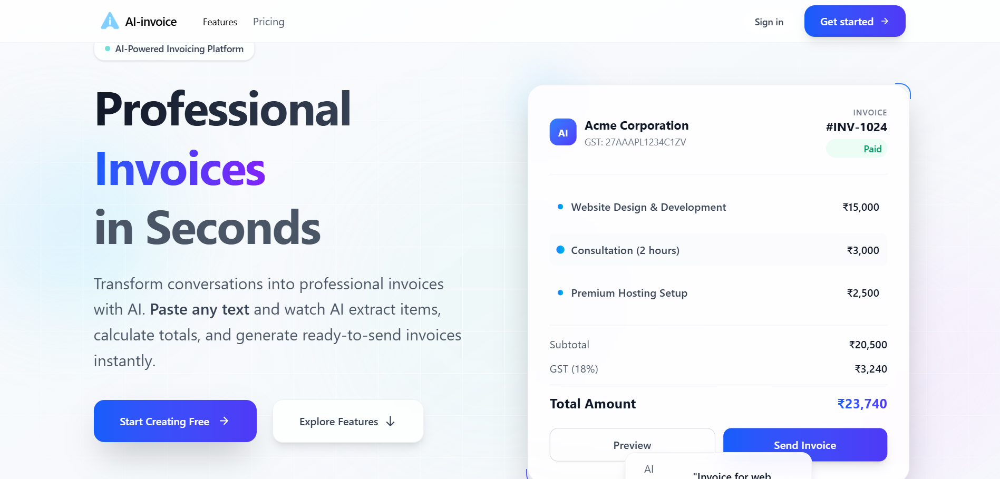
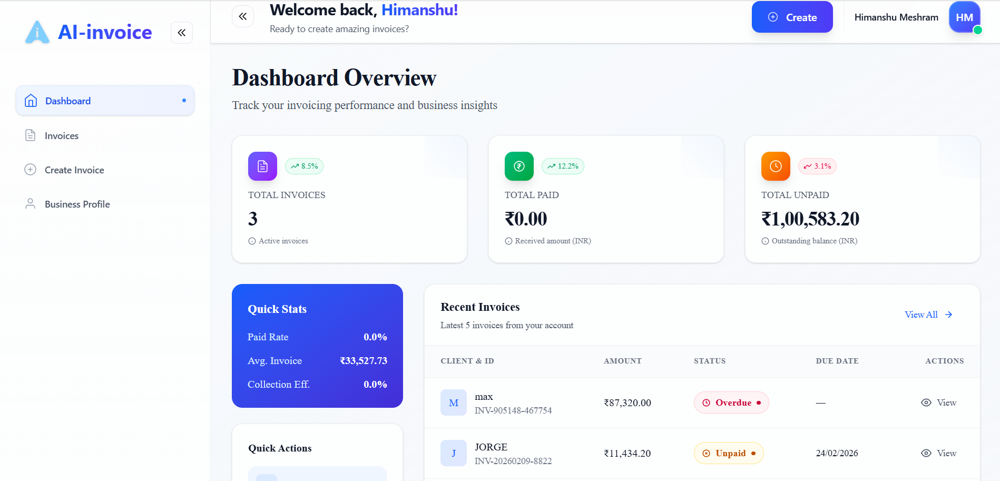

# AI Invoice Generator ✨


[](https://opensource.org/licenses/MIT)
[](https://reactjs.org/)
[](https://vitejs.dev/)
[](https://tailwindcss.com/)
[](https://www.mongodb.com/)
[](https://nodejs.org/)
[](https://expressjs.com/)
[](https://javascript.info/)
[](https://clerk.com/)
[](https://deepmind.google/technologies/gemini/)

### *Intelligent Invoicing Powered by AI*

AI Invoice Generator is a modern, high-performance web application designed to streamline the invoicing process for freelancers and small businesses. Leveraging the power of Google Gemini AI, it automates invoice creation and professional email reminders, ensuring a seamless financial workflow.

---

## 🏗️ Technologies Used

- **Frontend**: Built with **React 19** and **Vite** for a blazing fast UI, styled with **Tailwind CSS 4**.
- **Backend**: Powered by **Node.js** and **Express 5** for robust API management.
- **Database**: **MongoDB** managed via **Mongoose** for flexible data storage.
- **Artificial Intelligence**: Integrated with **Google Gemini AI** for smart content generation.
- **Authentication**: Secured with **Clerk** for seamless user sign-ins and profile management.
- **File Handling**: **Multer** for processing business assets like logos and signatures.

---

## 🚀 Features

- **Smart AI Invoice Creation**: Generate comprehensive invoices instantly using intelligent AI prompts.
- **AI-Powered Email Reminders**: Automatically draft professional, context-aware payment reminders using Gemini AI.
- **Automatic Calculations**: Precision-tuned logic for subtotals, GST/Tax, and final amounts.
- **Downloadable PDF Invoices**: Generate clean, professional PDF invoices directly from the browser.
- **User Authentication**: Secure onboarding and profile management powered by Clerk.
- **Business Profile Management**: Store company details, logos, signatures, and stamps for consistent branding.
- **Real-time Dashboard**: Track your financial health with interactive KPI cards and status tracking.
- **Modern Responsive UI**: A premium, glassmorphic design that works perfectly on desktop and mobile.

---

## 🛠️ Tech Stack

### Frontend
- **React 19**: Modern UI development with the latest hooks and features.
- **Vite**: Ultra-fast build tool for a superior development experience.
- **Tailwind CSS 4**: Functional-first styling for a sleek, responsive design.
- **React Router 7**: Robust client-side navigation.
- **Clerk**: Secure and easy-to-integrate authentication.

### Backend
- **Node.js & Express 5**: Scalable and fast server-side architecture.
- **MongoDB & Mongoose**: Flexible NoSQL database for structured data storage.
- **Google Gemini AI**: Powering the intelligent core of the application.
- **Multer**: Handling file uploads for logos and signatures.

---

## 📂 Project Structure

```bash
AI-Invoice-Generator/
├── frontend/             # React application
│   ├── src/
│   │   ├── components/   # Reusable UI components (InvoicePreview, AI Modal, etc.)
│   │   ├── pages/        # Main application views (Dashboard, Invoices, Profile)
│   │   └── assets/       # Styles and static assets
├── backend/              # Node.js Express server
│   ├── controllers/      # Business logic handlers
│   ├── models/           # Mongoose schemas (Invoice, BusinessProfile)
│   ├── routes/           # API endpoints
│   └── config/           # Database and AI configurations
└── README.md             # Project documentation
```

---

## ⚙️ Installation & Setup Instructions

### Prerequisites
- Node.js (v18+)
- MongoDB (Local or Atlas)
- Clerk account for authentication
- Google Gemini API Key

### Step-by-step Setup

1. **Clone the Repository**
   ```bash
   git clone https://github.com/yourusername/ai-invoice-generator.git
   cd ai-invoice-generator
   ```

2. **Backend Configuration**
   - Navigate to the `backend` folder: `cd backend`
   - Install dependencies: `npm install`
   - Create a `.env` file and add:
     ```env
     PORT=4000
     MONGO_URI=your_mongodb_uri
     GEMINI_API_KEY=your_gemini_key
     CLERK_SECRET_KEY=your_clerk_secret
     ```
   - Start the backend server: `npm start`

3. **Frontend Configuration**
   - Navigate to the `frontend` folder: `cd ../frontend`
   - Install dependencies: `npm install`
   - Create a `.env` file and add:
     ```env
     VITE_CLERK_PUBLISHABLE_KEY=your_clerk_publishable_key
     ```
   - Start the frontend development server: `npm run dev`

---

## ▶️ Usage Guide

1. **Setup Your Profile**: Go to the 'Business Profile' section to upload your logo, signature, and company details.
2. **Create an Invoice**: Use the 'Create Invoice' page. You can fill details manually or use the AI prompt to generate items automatically.
3. **Manage Invoices**: View all generated invoices on the 'Invoices' dashboard.
4. **Send Reminders**: Use the AI Mail icon on any invoice to generate a professional reminder email.
5. **Print/Save**: Click on any invoice to preview it and use the "Print / Save as PDF" button.

---

## 📸 Screenshots

| Dashboard View | Invoice Management |
| :---: | :---: |
|  |  |

| AI-Invoice Genrator|  AI Reminder Modal |
| :---: | :---: |
|  |  |

---

## 🌟 Key Highlights

- **ATS-Friendly Schema**: Optimized project structure and documentation.
- **AI Integration**: First-class support for Generative AI in financial workflows.
- **Zero-Latency UI**: Optimized React components for a snappy user experience.
- **End-to-End Security**: Clerk-powered auth ensures data privacy.

---

## 🔮 Future Improvements

- [ ] Multi-currency support for international invoicing.
- [ ] Integration with payment gateways (Stripe/PayPal).
- [ ] Advanced analytics and expense tracking.
- [ ] Team collaboration features.

---

## 🤝 Contributing

Contributions are what make the open-source community such an amazing place to learn, inspire, and create. Any contributions you make are **greatly appreciated**.

1. Fork the Project
2. Create your Feature Branch (`git checkout -b feature/AmazingFeature`)
3. Commit your Changes (`git commit -m 'Add some AmazingFeature'`)
4. Push to the Branch (`git push origin feature/AmazingFeature`)
5. Open a Pull Request

---

## 📄 License

Distributed under the MIT License. See `LICENSE` for more information.

---

## 👨‍💻 Author Information

**Your Name**
- GitHub: [@yourusername](https://github.com/yourusername)
- LinkedIn: [Your Profile](https://linkedin.com/in/yourusername)

 
 
